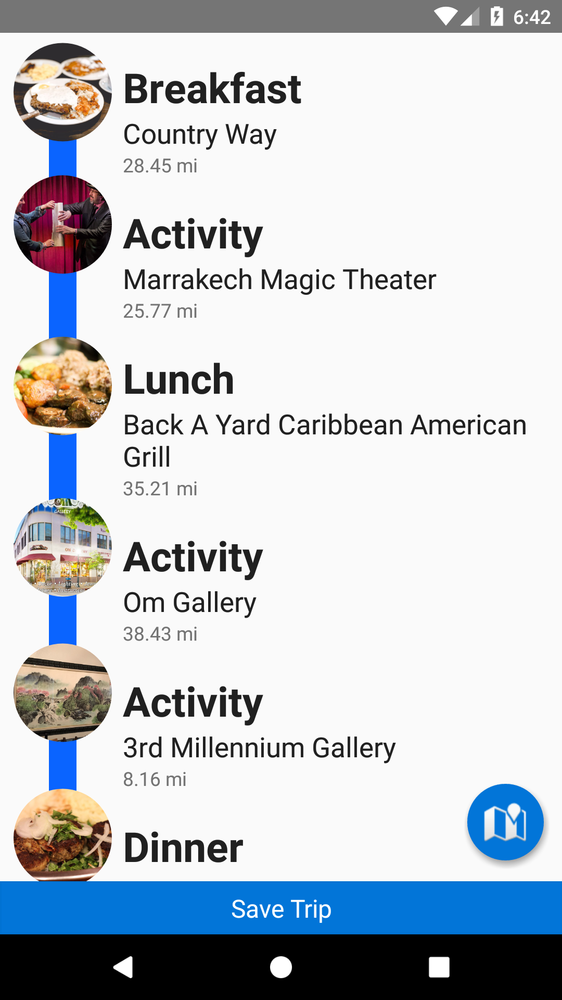

# TapGuide
A free automatic itinerary planner for travellers

## Why Should Travellers Use TapGuide?
TapGuide reduces the overhead needed to plan out a perfect day. Instead of hunting yelp for 3 restaurants and a few activities to do, this app gathers them all into one place. If you find a trip you like, you can save it to your phone.

## Libraries Used
[Paper](https://github.com/pilgr/Paper) for local storage  
[SpinKit](https://github.com/ybq/Android-SpinKit) for an animation  
[Picasso](http://square.github.io/picasso/) for awesome image loading  
[Yelp-Fusion-Client](https://github.com/ranga543/yelp-fusion-android) to access yelp  
[Android-Bootstrap](https://github.com/Bearded-Hen/Android-Bootstrap) because it looks really nice  
A modified version of [TimelineView](https://github.com/qapqap/TimelineView)  

## Screenshots
   

